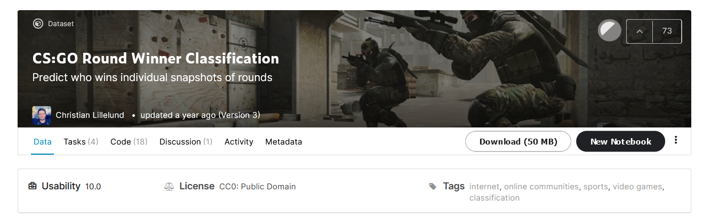

# Pràctica Kaggle APC UAB 2021-22
### Nom: Víctor González Escribá - 1528873
### DATASET: CS:GO Round Winner Classification
### URL: [kaggle] https://www.kaggle.com/christianlillelund/csgo-round-winner-classification

### Resum
El dataset utilitza dades del videojoc CS:GO (Counter Strike Global Offensive). Es tracta
d'un videojoc first-person shooter. El joc consisteix en que l'equip T (Terrorist) ha de fer 
explotar una bomba i l'equip CT (Counter Terrorist) ha d'evitar-ho.

Disposem d'un dataset amb 122410 mostres amb 97 atributs (122410 x 97).  
Alguns atributs dels que disposem són: el mapa, la vida dels equips, els diners, les armes, etc.

### Objectius del dataset
Generar diferents models que puguin classificar quin equip guanyarà la partida a partir dels atributs disponibles i comparar els resultats.

### Experiments
Durant aquesta pràctica, he realitzat experiments amb dos models:
Un Logistic Regressor, un Decision Tree i un KNN. A més s'ha utilitzat GridSearchCV (excepte en KNN), que fa èmfasi
en diferents paràmetres com la profunditat màxima en el decision tree i a més aplica cross validation.
Aquesta estratègia d'utilitzar un optimitzador l'he vist en alguns exemples de codi al kaggle.

### Preprocessat
Per millorar el rendiment dels models, al fitxer "generate_features.py", s'ha aplicat una neteja de dades:
- Eliminem aquells atributs que tenen un únic valor.
- A l'atribut objectiu "round_winner" canviem els valors de T i CT per 0 i 1 respectivament.
- A l'atribut "bomb_planted" el canviem de tipus booleà per tipus enter.
- Eliminem la columna target "round_winner" després de guardar-la en una variable a part, per evitar així càlculs innecessaris.
- Codifiquem l'atribut "map" per facilitar els càlculs.
- Per últim escalem el dataset, ja que és necessari per poder executar els estimadors (models)

### Models
Execucions fetes al notebook develop
| Model | Hiperparametres | Accuracy | Temps |

| LogisticRegressor | default i max_iter=1000, fit_intercept | 75 % | 15.04s |

| DecisionTree | default i max_depth, min_samples_leaf | 81% | 29.4s |

| KNN | n_neighbors=[5, 6, 7, 8] | 80 % | 4min |

### Demo 
Per tal de fer una prova, podem executar la següent comanda: "python3.9 demo/demo.py"
Aquesta prova és una execució amb només 1000 mostres del dataset, permet veure una execució petita de tot el codi.

!!! Si l'execució de la demo en IDE (no per terminal) no funciona, canviar la ruta de la linea 43 per
'../data/csgo_round_snapshots.csv'. Aquesta comanda dona problemes i no he aconseguit solucionar-ho.

Per executar el codi sencer cal executar la comanda:
"python3.9 src/main.py"

### Conclusions
El model que dona millors resultats és el model de DecisionTree (accuracy = 81%), seguit del KNN (accuracy=80%) i Linear Regressor (accuracy=75%).

Tot i això, els temps d'execució són molt alts, però cal tenir en compte que el dataset amb el que s'ha treballat és molt gran i en totes
les execucions dels dos primers models s'ha aplicat cross validation. 
En quant al temps d'execució del KNN, crec que el problema ha estat escalar el dataset per poder aplicar el GridSearchCV en els dos primers models que ha provocat que
l'execució d'aquest model sigui molt lenta.

### Idees per treballar en un futur
Crec que seria interessant provar els models sense escalar les dades, per poder comparar-los en unes característiques "normals" i veure si així disminueixen els temps d'execució.
